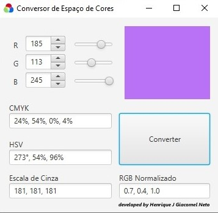

# 🎨 Conversor de Espaço de Cores / Color Space Converter

---

## 🇧🇷 Português

### Descrição
Aplicativo desktop desenvolvido em JavaFX que realiza conversões entre diferentes espaços de cores a partir de valores RGB.

**Conversões suportadas:**
- RGB → CMYK
- RGB → HSV
- RGB → Escala de Cinza
- RGB → RGB Normalizado

### Screenshot

### Tecnologias utilizadas
- Java 21
- JavaFX 21
- SceneBuilder
- IntelliJ IDEA
- Maven

### Como rodar
**Executável (sem precisar de Java)**
1. Baixe a pasta `ConversorCores` do repositório
2. Abra a pasta e clique duas vezes em `ConversorCores.exe`

## 🇺🇸 English

### Description
Desktop application developed in JavaFX that converts between different color spaces based on RGB values.

**Supported conversions:**
- RGB → CMYK
- RGB → HSV
- RGB → Grayscale
- RGB → Normalized RGB

### Screenshot
> *(add an app screenshot here)*

### Technologies used
- Java 21
- JavaFX 21
- SceneBuilder
- IntelliJ IDEA
- Maven

### How to run
**Executable (no Java required)**
1. Download the `ConversorCores` folder from the repository
2. Open the folder and double-click `ConversorCores.exe`

---

**Desenvolvido por / Developed by:** Henrique J Giacomel Neto
